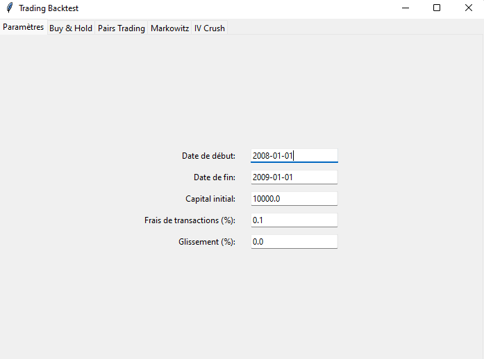
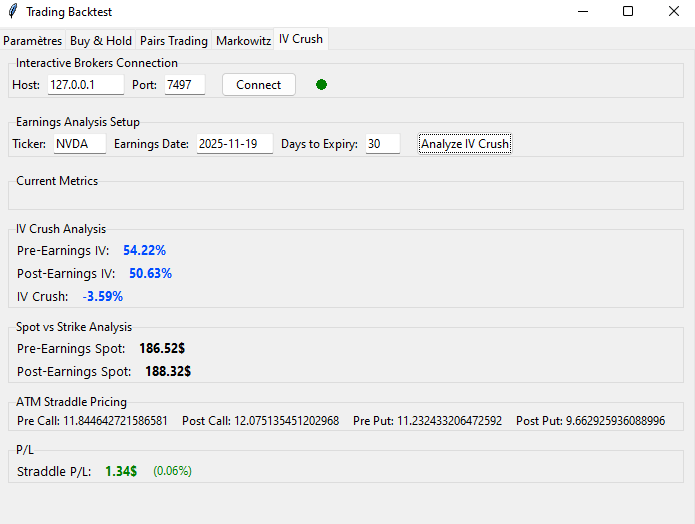
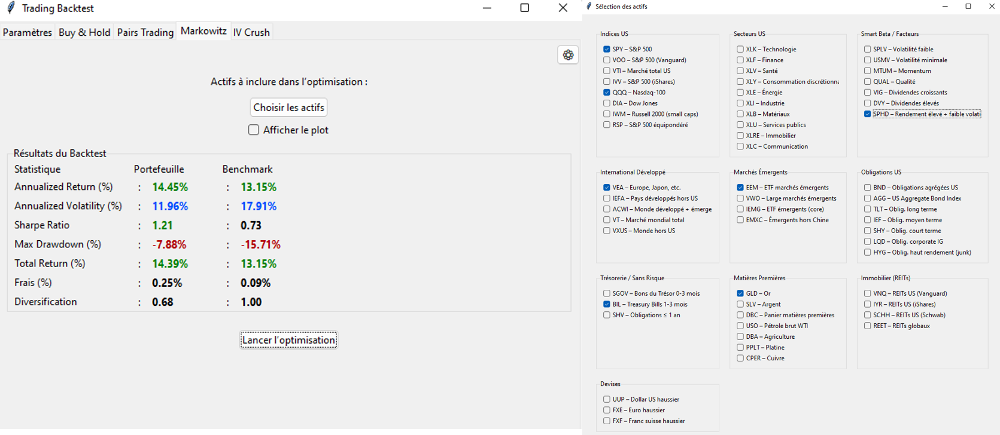
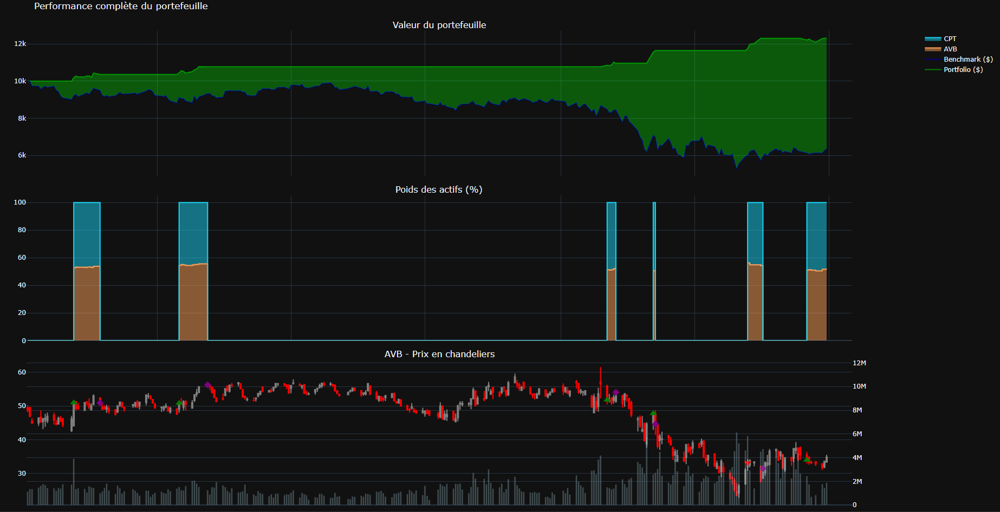

# Quant Trading & Backtesting Platform

A modular Python trading and backtesting platform with a graphical interface
to analyze systematic strategies across multiple asset classes.

## Overview

This project provides an end-to-end framework for:
- strategy definition
- portfolio construction and optimization
- historical backtesting with transaction costs
- performance and risk analysis

The platform is designed to replicate the workflow of systematic
trading and quantitative asset management.

## User Interface

The application offers a graphical interface to configure backtests,
select assets and strategies, and visualize results.

### Global backtesting parameters


### IV crush analyzer


### Portfolio optimization (Markowitz)


### Interactive performance visualization


## Implemented strategies

- **Buy & Hold**
- **Pairs Trading**
- **Markowitz portfolio optimization**
- **IV crush analyzer** (for earnings events)

## Backtesting and risk metrics

- Annualized return and volatility
- Sharpe ratio
- Maximum drawdown
- Transaction costs and slippage
- Portfolio diversification metrics
- Benchmark comparison

## Architecture

The platform is built with a clear separation between:
- strategy logic
- backtesting engine
- portfolio and risk metrics
- user interface

Strategies are fully decoupled from the backtesting engine, allowing
easy extension and experimentation.

## How to run

```bash
pip install -r requirements.txt
python main.py
